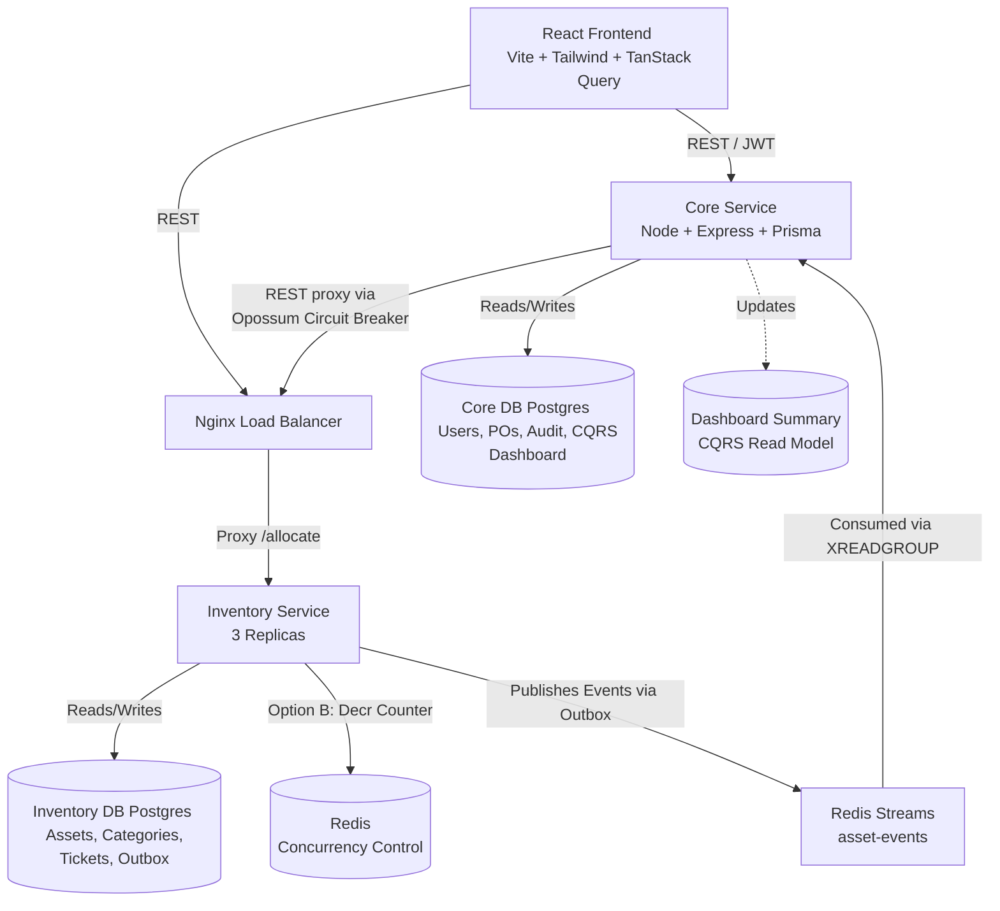
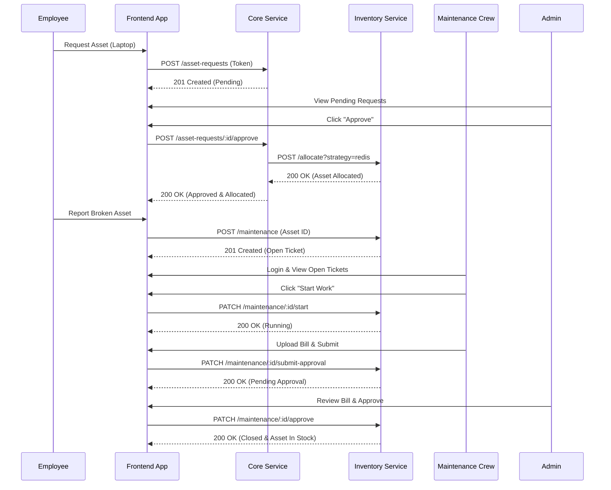
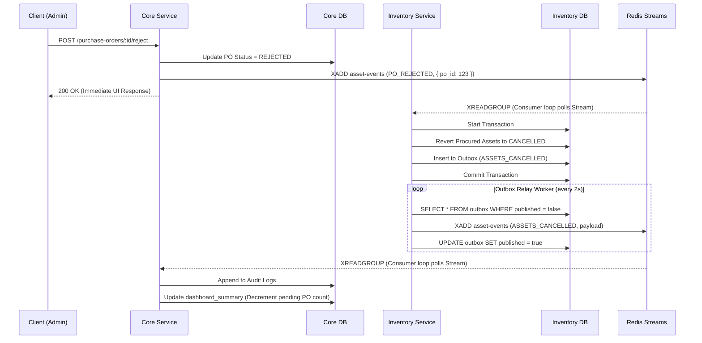

# IT_WMS — Project Phases & Architecture

This is a living document tracking the phases of development and the evolving architecture of the IT_WMS system.

## Current Architecture

---

## User Cycle Diagram (RBAC Workflows)

## Function Cycle Diagram (Distributed Saga & CQRS)

## Completed Phases

### Phase 0: Foundation
- Designed schemas for both the Core DB and Inventory DB (Database-per-service pattern).
- Created the initial `docker-compose.yml` to spin up two isolated PostgreSQL instances and one Redis instance.

### Phase 1 & 2: Inventory Service & Concurrency Control
- Built the `inventory-service` using Node.js, Express, and Prisma.
- **Option A**: Implemented pessimistic locking via Postgres (`SELECT FOR UPDATE SKIP LOCKED`).
- **Option B**: Implemented atomic concurrency control via Redis (`DECR` counter).
- Proved correctness of high-contention `/allocate` endpoint using load testing scripts.

### Phase 3: Core Service & Procurement
- Built the `core-service` using Node.js, Express, and Prisma.
- Implemented Authentication and basic RBAC (Role-Based Access Control).
- Implemented Purchase Order (PO) creation and approval flows.
- Implemented an Idempotency Key cache pattern in Redis on the PO approval route to prevent double-billing during network retries.

### Phase 4: Event-Driven Architecture (Transactional Outbox)
- Solved the dual-write problem by implementing the Transactional Outbox pattern.
- Built a background relay worker in `inventory-service` that polls the `OutboxEvent` table and reliably publishes to **Redis Streams**.
- Built a consumer loop in `core-service` (`XREADGROUP`) to consume these events idempotently and write them to the `AuditLog` table.

### Phase 5: Frontend Foundation
- Scaffolded a Vite + React application.
- Set up Tailwind CSS (v3) with a strict, minimalist SaaS aesthetic (`design.md` compliance: 1px borders, muted colors, Geist font).
- Integrated `react-router-dom` and `@tanstack/react-query` for data fetching.
- Built initial pages: Login, Dashboard, Inventory, Purchase Orders, and Audit Log.

### Phase 5.5a: Backend Feature Expansion
- **Inventory Service**: Added `Category` and `MaintenanceTicket` models. Added support for dynamic JSONB `properties` on Assets. Implemented robust REST endpoints for CRUD, CSV Export, ExcelJS Import, and Dashboard aggregation.
- **Core Service**: Replaced mock authentication with real `bcryptjs` password hashing and a proper `User` table. Added extensive fields to `PurchaseOrder`. Implemented a `/system/health` aggregator and a `/system/export` endpoint capable of downloading both databases as a single JSON file.

### Phase 5.5b: Frontend Feature Expansion
- Integrated `recharts` for rich data visualization on the Dashboard (Asset Distribution, Stock Availability, Procurement Spend).
- Upgraded the **Inventory** page with a 2-column layout for Category management, advanced filters, and a dynamic Create Asset modal.
- Built a dedicated **Maintenance** page with filtering tabs and a resolution workflow.
- Reorganized **Settings** to encapsulate Audit Logs, User Management (Admin-only), and a 1-click System Data Export button.

### Phase 5.6a: Advanced Data & Logic
- **Inventory Service**: Promoted `serial_number` to an indexed column. Refined asset search to match `asset_tag`, `name`, and `serial_number`. Expanded Asset state machine with `RETIRED` state. Added `parts_used` and `bill_url` to maintenance tickets with Cloudinary file upload integration.
- **Core Service**: Added detailed properties and specific rejection workflows for Purchase Orders, triggering cross-service compensation.

### Phase 5.6b: UI, Charts & Role-Based Views
- Built dynamic dashboard with `recharts` for top categories, stock availability, and procurement spend.
- Upgraded the Inventory table with global search and column filters, plus a "Report Issue" flow.
- Added role-based conditional rendering so maintenance crews only see relevant views.

### Phase 5.6c: System Design Hardening (Industry-Ready)
- **CQRS Read Model**: Implemented `dashboard_summary` table in core-service updated via Redis Stream consumer for live aggregation-free stats.
- **Rate Limiting**: Added Redis-backed token bucket middleware at `core-service` entry per user.
- **Circuit Breaker**: Wrapped inter-service REST calls from `core-service` to `inventory-service` with `opossum` to prevent cascading failures.
- **Saga Pattern**: Implemented a compensating transaction workflow where a `PO_REJECTED` event from core-service reliably reverts procured assets back to `CANCELLED` in inventory-service.
- **Distributed Tracing**: Enforced `X-Request-ID` propagation across HTTP headers and Redis Stream payloads for correlated logging.
- **Horizontal Scaling Verification**: Dockerized all components and deployed a 3-replica load-balanced `inventory-service` using Nginx. Verified CP-guarantee with a 100-concurrent request load test confirming absolutely zero overselling.

### Phase 6: Cloud Deployment & Live Load Testing
- Configured CI/CD using GitHub Actions to automatically run Jest tests on `push` and `pull_request` events.
- Deployed the databases (Postgres) and Cache (Redis) to the Render cloud.
- Deployed Backend services on Render Web Services and Frontend on Vercel.
- Executed `k6` load tests against the live deployment to prove zero-overselling concurrency safety, capturing p50, p95, p99 latencies for both pessimistic locking and atomic Redis counters.
- Executed rate-limiting load test proving exactly 50 requests successfully pass while 10 are cleanly rejected with a 429 status code.

### Phase 5.9: Final Polish & Demo UI
- **Optimistic Updates**: Integrated TanStack Query `onMutate` for instantaneous UI feedback on asset allocations and PO approvals, rolling back seamlessly on error.
- **Dark Mode**: Configured CSS variables mapped to Tailwind configuration to support a seamless, system-respecting dark theme toggle across all pages.
- **Live Concurrency Demo**: Created a dedicated visual dashboard (`/concurrency-demo`) for administrators to fire 100 concurrent allocation requests from the frontend, visually demonstrating the Opossum Circuit Breaker and backend concurrency logic in real-time.

### Phase 7: End-to-End Verification & Concurrency Audits
- **Synthetic Data Seeding**: Built automated node script (`scripts/seed-demo-data.js`) bypassing the frontend to seed 5 categories, 10 role-based users, 100 assets, 15 asset requests, and 15 maintenance tickets over live APIs.
- **Concurrency Lost Update Fix**: Identified and patched race conditions in `/asset-requests/:id/approve` and `/maintenance/:id/approve` replacing vulnerable `findUnique` -> `update` chains with atomic `updateMany` conditional checks (`status = 'PENDING'`). Verified via multi-actor scripts.
- **Multi-Actor Load Simulation**: Extended simulation scripts to hammer the system with 10 exact-second concurrent Employee requests followed by 10 concurrent Admin approvals, successfully returning exactly one `200 OK` and nine `409 Conflict (Out of Stock)` safely swallowed by the Opossum Circuit breaker.
- **Enhanced Role-Based Access Control & Password Management**: 
  - Finished dynamic routing logic to prevent infinite redirect loops for non-admin roles (Employee/Maintenance Crew).
  - Built `PATCH /users/:id/password` capabilities to allow Admins full credential management via the Settings panel with UI password visibility toggles.
  - Added Show/Hide toggles to the main `Login` page.
- **Maintenance Lifecycle**: Fully realized the `OPEN` -> `RUNNING` -> `PENDING_APPROVAL` -> `CLOSED` workflow by adding backend state transition API endpoints (`/maintenance/:id/start`) and mapping them to the frontend Maintenance Crew dashboards.