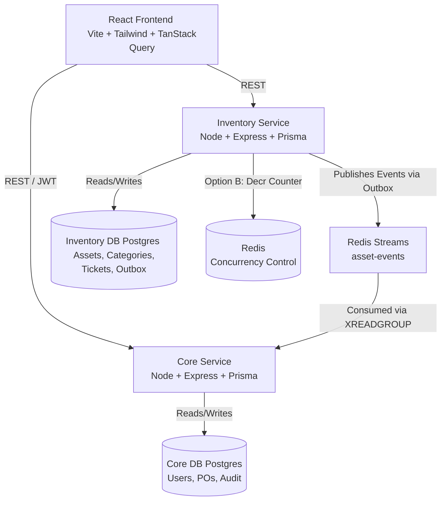

# IT_WMS — Project Phases & Architecture

This is a living document tracking the phases of development and the evolving architecture of the IT_WMS system.

## Current Architecture

---

## Completed Phases

### Phase 0: Foundation
- Designed schemas for both the Core DB and Inventory DB (Database-per-service pattern).
- Created the initial `docker-compose.yml` to spin up two isolated PostgreSQL instances and one Redis instance.

### Phase 1 & 2: Inventory Service & Concurrency Control
- Built the `inventory-service` using Node.js, Express, and Prisma.
- **Option A**: Implemented pessimistic locking via Postgres (`SELECT FOR UPDATE SKIP LOCKED`).
- **Option B**: Implemented atomic concurrency control via Redis (`DECR` counter).
- Proved correctness of high-contention `/allocate` endpoint using load testing scripts.

### Phase 3: Core Service & Procurement
- Built the `core-service` using Node.js, Express, and Prisma.
- Implemented Authentication and basic RBAC (Role-Based Access Control).
- Implemented Purchase Order (PO) creation and approval flows.
- Implemented an Idempotency Key cache pattern in Redis on the PO approval route to prevent double-billing during network retries.

### Phase 4: Event-Driven Architecture (Transactional Outbox)
- Solved the dual-write problem by implementing the Transactional Outbox pattern.
- Built a background relay worker in `inventory-service` that polls the `OutboxEvent` table and reliably publishes to **Redis Streams**.
- Built a consumer loop in `core-service` (`XREADGROUP`) to consume these events idempotently and write them to the `AuditLog` table.

### Phase 5: Frontend Foundation
- Scaffolded a Vite + React application.
- Set up Tailwind CSS (v3) with a strict, minimalist SaaS aesthetic (`design.md` compliance: 1px borders, muted colors, Geist font).
- Integrated `react-router-dom` and `@tanstack/react-query` for data fetching.
- Built initial pages: Login, Dashboard, Inventory, Purchase Orders, and Audit Log.

### Phase 5.5a: Backend Feature Expansion
- **Inventory Service**: Added `Category` and `MaintenanceTicket` models. Added support for dynamic JSONB `properties` on Assets. Implemented robust REST endpoints for CRUD, CSV Export, ExcelJS Import, and Dashboard aggregation.
- **Core Service**: Replaced mock authentication with real `bcryptjs` password hashing and a proper `User` table. Added extensive fields to `PurchaseOrder`. Implemented a `/system/health` aggregator and a `/system/export` endpoint capable of downloading both databases as a single JSON file.

### Phase 5.5b: Frontend Feature Expansion
- Integrated `recharts` for rich data visualization on the Dashboard (Asset Distribution, Stock Availability, Procurement Spend).
- Upgraded the **Inventory** page with a 2-column layout for Category management, advanced filters, and a dynamic Create Asset modal.
- Built a dedicated **Maintenance** page with filtering tabs and a resolution workflow.
- Reorganized **Settings** to encapsulate Audit Logs, User Management (Admin-only), and a 1-click System Data Export button.

---

## Upcoming Phases

### Phase 6: Deploy + Load Test
- Containerize both Node.js services with `Dockerfile`s.
- Deploy the databases (Neon Postgres) and Cache (Upstash Redis) to the cloud.
- Deploy Backend services (e.g., Render) and Frontend (e.g., Vercel).
- Execute `k6` load tests against the live deployment to prove zero-overselling concurrency safety.
